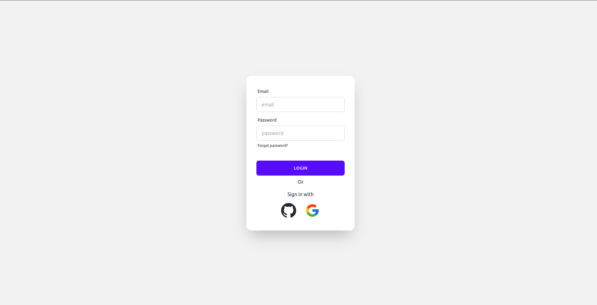
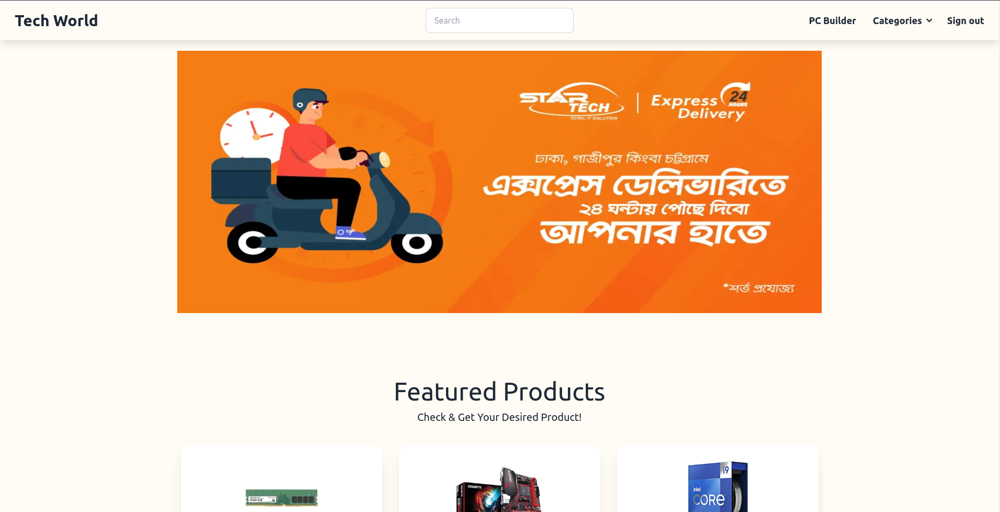
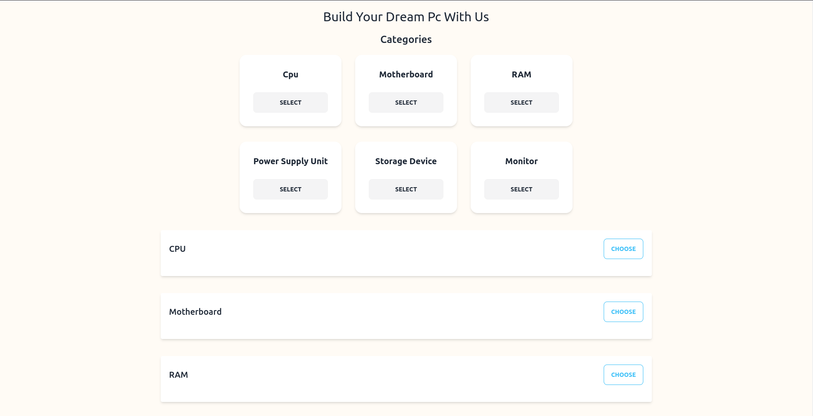
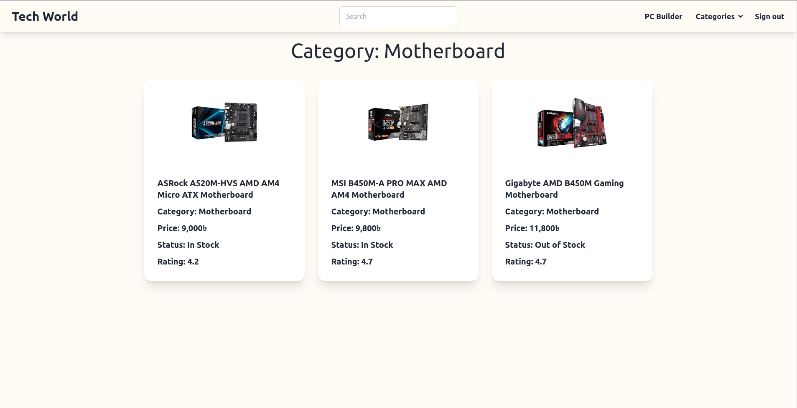

# Tech World

### Login page

### Home page

### PC Builder  page

### Category page

## Description :

Tech World has been founded on 30 July 2023. From then to now, Tech World has won the heart of many people and now is a
country-wide renowned brand. That has been possible due to the hard work Tech World has done to satisfy its customers.
Having the aim to satisfy customers, providing customers with their required products, and being true to their motto,
“Customers Come First,” has brought Tech World to the top choice for E-Commerce Sites in Bangladesh and is recognized as
the largest Computer and Tech retailer. Tech World is located in 6 Central territories in Dhaka and Sylhet. Tech World
has a total of 17 Physical outlets all over the country; selling genuine Tech products. Among them, 9 outlets are in
Dhaka as it’s the capital city. Apart from the Physical Branches, We also have our successful E-Commerce website.

## Features
- Customers Can buy their favorite PC components in reasonable prices.
- Customers Can build their dream pc from PC Builder option.
- They can also log in with social platforms like Google and GitHub.

### Live Link: https://tech-world-client.vercel.app/
